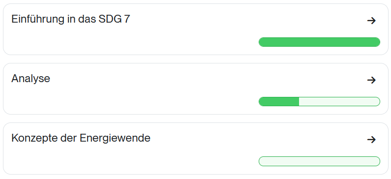
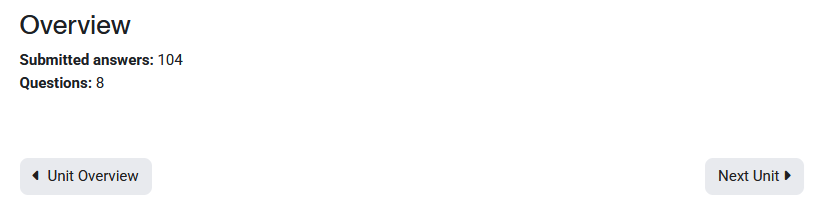
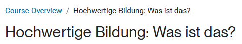

moodle-theme_sdg_boost_union
==============================

Installation
------------

Install Boost Union Child like any other plugin to folder
/theme/sdg_boost_union

See http://docs.moodle.org/en/Installing_plugins for details on installing Moodle plugins

Usage
-----

After installing Boost Union Child, it does not do anything to Moodle or Boost Union yet.

Boost Union Child integrates into the Boost Union settings as an additional settings page which you find on:
Site administration -> Appearance -> Boost Union -> Boost Union Child.

There, you find some settings:

### Settings page "Boost Union Child"

#### Tab "General settings"

In this tab there are the following settings:

##### Pre SCSS inheritance

With this setting, you control if the pre SCSS code from Boost Union should be inherited or duplicated.

Most of the time, inheriting will be perfectly fine. However, it may happen that imperfect code is integrated into Boost Union which prevents simple SCSS inheritance for particular Boost Union features. If you encounter any issues with Boost Union features which seem not to work in Boost Union Child as well, try to switch this setting to 'Dupliate' and, if this solves the problem, report an issue on Github (see the 'Bug and problem reports' section below for details how to report an issue).

##### Extra SCSS inheritance

With this setting, you control if the extra SCSS code from Boost Union should be inherited or duplicated.

The reason behind this setting is the same as for the 'Pre SCSS inheritance' setting.

Additional Features implemented in this theme
-----

### Progressbar
The activity completion status inside of courses has been replaced. Progress is now shown with a progress bar for each section of the course.

### H5P tooltips for "transcript"
This theme adds tooltips to some of the buttons contained in
the H5P content type [transcript](https://www.olivertacke.de/labs/2022/10/25/ho-ho-ho-now-i-have-a-content-type-starting-with-t/).

### Section navigation
The section navigation within courses has been redone. While moodle core skips the summary pages between course sections, the new navigation,
includes the summary page. Furthermore the text display on the navigation buttons has been changed. "Next/Previous Unit" and "Unit overview" is displayed instead of the name of
the next/previous activity.

### Breadcrumb
The breadcrumb inside of courses has been changed. Instead of displaying the name of the course, "Course Overview" is displayed. This string is
configurable via the language package.

